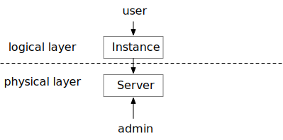
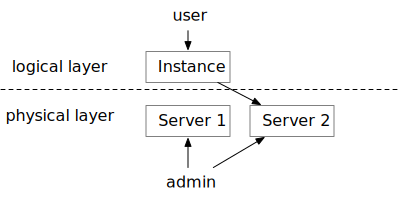
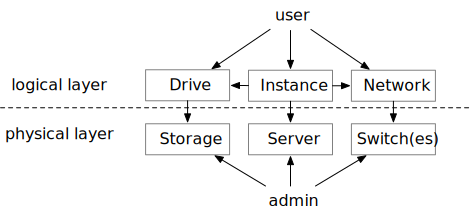
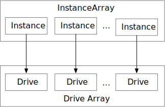

# Important concepts & terminology

## Terminology
The Metal Cloud uses a few concepts that set it apart from other vendors thus a recap is in order:

1. **Infrastructure** - A collection of servers, drives etc. It is both a grouping construct and a security construct. Users can have as many infrastructures as they like.
2. **InstanceArray** - A collection of identical **Instances** (servers). All operations are done on an InstanceArray rather than on individual instances. For example attaching an InstanceArray's network port to a network will cause all of it's instances to do the same. The most important property of an InstanceArray is the fact that it can be expanded or shrinked (by using the `instance_array_instance_count` property).
3. **DriveArray** - **Drives** (iSCSI LUNs) are groupped in an "Array" as well. A DriveArray can be attached to an InstanceArray in which case it will "grow" or "shrink" with it. This means new drives will be created and/or some drives will deleted as the instance array is shrinked.
5. **SharedDrive**** iSCSI LUN that are shared by more than one instance. Use this with VMWare, Kubernetes etc.
6. **VolumeTemplate** - A **Drive** (iSCSI LUN) can be created by cloning a template. This is used to create Drives that have an operating system on them.
7. **Network** - A network is an abstract concept whose implementation differs from "Datacenter to datacenter" (it can be Layer 2, Layer 3, VLAN based, VPLS or VXLAN based tc. but fundamentally it will isolate servers from reaching each other and provide reachability to the internet or the SAN network.
8. **Subnet** -  In L2 network implementations, IPs are allocated to Infrastructures in blocks rather than individually. They can be of different sizes: /30, /29, /27 etc.
9. **Datacenter** - Typically datacenters are resource pools, they hold servers, storages networks etc.

## Deploy and design mode

The Metal Cloud uses a two stage approach to provisioning where a user would describe changes required and then apply them in bulk. Changes can also be reverted to the deployed state thus all operations with the `prevent_deploy=true` will result only in the editing of the infrastructure and not the actual provisioning. In order for the changes to be provisioned, prevent_deploy needs to be explicitly set to false `prevent_deploy=false`.

## Servers and Instances

To enable hardware replacement while keeping firewall rules, dns records etc, there is a mapping between the physical equipment and it's "logical" equivalent which is tied to a workload or a particular use. The logical allocation is called an "**Instance**" whereas the physical equipment is called a "**Server**".

The mapping between an instance and a server is done at "provisioning" time and is created when the user "requests" a compute resource. An instance can be mapped to another server if the user needs more resources or needs a replacement.

Instances have associated "Drives" and "Networks". Drives can be moved across storages and Networks typically span multiple switches.

Instances can be "stopped" which will release the server to the pool but will keep all other configurations such as server type, network, OS, firewall configurations etc.

>The Metal Cloud supports installing the OS on a local drive. When releasing the server associated with an instance the content of all local drives will be wiped.

## InstanceArrays and DriveArrays

From the "user's" perspective Multiple Instances are grouped together in **InstanceArrays**. An InstanceArray can be "resized" which means the same "InstanceArray-wide" settings will apply to the new instances. This is helpful for managing application clusters.

An InstanceArray can be connected to a DriveArray which in turn groups Drives. Each Instance will get an associated Drive. DriveArrays can be disconnected from each other.

These concepts are logical-level concepts.

